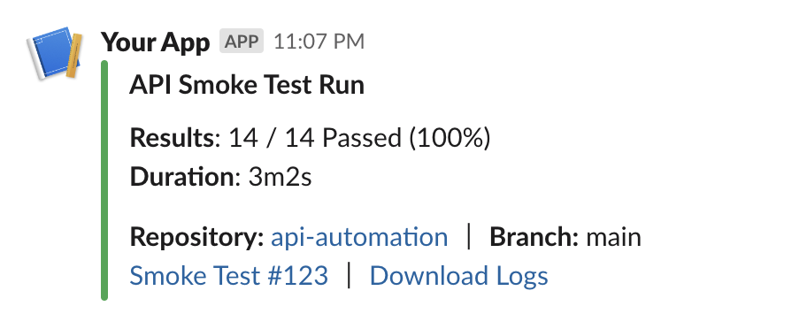

---
tags:
  - ci
  - cd
  - azure
  - devops
  - git
  - github
  - workflows
  - actions
  - continuous integration
---

# CI Info

Attaches Continuous Integration (CI) information to the report.

> Supports [GitHub Actions](https://github.com/features/actions), [Azure Pipelines](https://docs.microsoft.com/en-us/azure/devops/pipelines/)

::: details DEFAULTS

- hook: `end`
- condition: `passOrFail`

:::

## Syntax

```json
{
  "name": "ci-info",
  "inputs": {
    "show_repository": false,
    "data": [
      {
        "key": "Download Logs",
        "value": "<custom url>",
        "type": "hyperlink"
      }
    ]
  }
}
```

- `show_repository` (**boolean**) - show repository name and link.
- `show_repository_branch` (**boolean**) - show repository branch name.
- `show_build` (**boolean**) - show build name and link.
- `data` (**object[]**) - list of data objects.
  - `key` (**string**) - text to display as a key.
  - `value` (**string|function**) - text to display as a value. URL in case of hyperlink.
  - `type` (**string**) - type of data. allowed values - `hyperlink`
  - `condition?` (**[condition](/guides/conditions)**) - condition to include this data.

## Reports

### Slack



## Examples

### Simple

Attaches repository name/link, repository branch name, build name/link.

```js
{
  "targets": [
    {
      "name": "teams",
      "inputs": {
        "url": "<teams-incoming-webhook-url>"
      },
      "extensions": [
        {
          "name": "ci-info"
        }
      ]
    }
  ],
  "results": [
    {
      "type": "testng",
      "files": [
        "path/to/testng-results.xml"
      ]
    }
  ]
}
```

### Custom Links

Attaches custom link to download logs.

```js
{
  "targets": [
    {
      "name": "teams",
      "inputs": {
        "url": "<teams-incoming-webhook-url>"
      },
      "extensions": [
        {
          "name": "ci-info",
          "data": [
            {
              "key": "Download Logs",
              "value": "<custom url>",
              "type": "hyperlink"
            }
          ]
        }
      ]
    }
  ],
  "results": [
    {
      "type": "testng",
      "files": [
        "path/to/testng-results.xml"
      ]
    }
  ]
}
```
