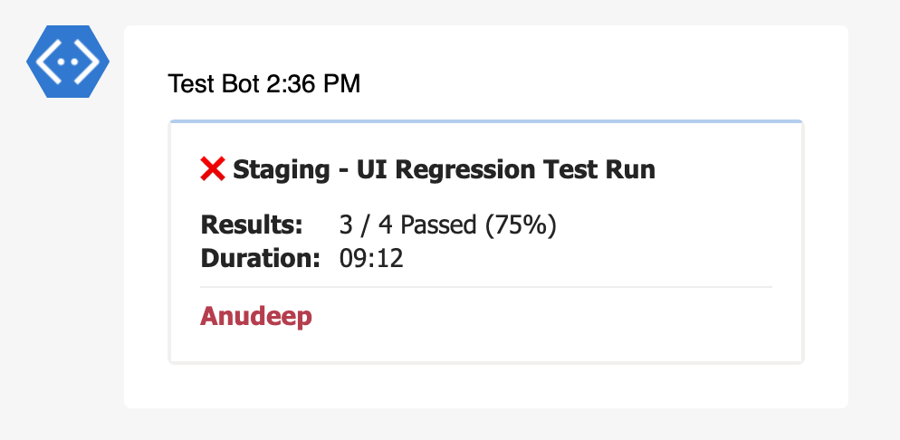
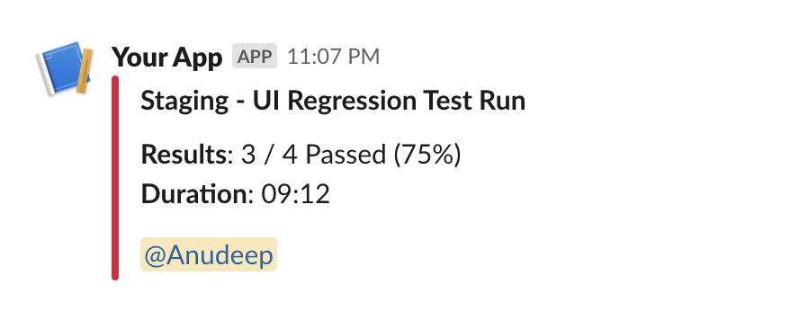

---
tags:
  - on-call
  - oncall
  - tag user
---

# Mentions

Mentions will tag users in the slack or teams messages to alert them.

::: tip

In general, tagging users will help to maintain accountability on owning test failures. It also reduces the ambiguity on who needs to look into failures based on a on-call schedule. 

:::

::: details DEFAULTS

- hook: `end`
- condition: `fail`

:::

## Inputs

#### > users (object[]) _(optional)_

List of users.

#### > users.name (string)

Name of the user.

#### > users.team_upn (string)

User's [UPN](https://docs.microsoft.com/en-us/azure/active-directory/hybrid/plan-connect-userprincipalname) in teams. Mandatory if the target is **teams**.

#### > users.slack_uid (string)

User's [unique id](https://www.workast.com/help/articles/61000165203) in slack. Mandatory if the target is **slack**.

#### > users.enable (boolean) _(optional)_

Enable or disable user's availability for on-call support. 

> If a user is disable, the next user enabled user will be picked. If no user is enabled, then the original user is mentioned.

#### > schedule (object) _(optional)_

On-call schedule.

#### > schedule.layers (object[])

On-call schedule layers. If there are multiple layers, the layer will take precedence in a given time frame.

#### > schedule.layers.start (string) _(optional)_

Start time of the layer mentioned in the format of `HH:MM:SS`.

#### > schedule.layers.end (string) _(optional)_

End time of the layer mentioned in the format of `HH:MM:SS`.

#### > schedule.layers.user (object)

Layer user.

>  Use this if there is only one user.

#### > schedule.layers.rotation (object)

Layer rotation. 

> Use this if there are multiple users.

#### > schedule.layers.rotation.every (string)

Rotate a user on the given schedule.

**Supports**

- [day](https://www.epochconverter.com/daynumbers)
- [week](https://www.epochconverter.com/weeknumbers)

#### > schedule.layers.rotation.users (object[])

Rotation users.

## Reports

### Teams

<!--  -->

### Slack

<!--  -->

## Examples

#### Mentioning a user.

Sample config file, where the same user will be mentioned every time.

```js {12-20}
{
  "reports": [
    {
      "targets": [
        {
          "name": "teams",
          "inputs": {
            "url": "<teams-incoming-webhook-url>"
          },
          "extensions": [
            {
              "name": "mentions",
              "inputs": {
                "users": [
                  {
                    "name": "Jon",
                    "teams_upn": "jon@microsift.com"
                  }
                ]
              }   
            }
          ]
        }
      ],
      "results": [
        {
          "type": "testng",
          "files": ["path/to/testng-results.xml"]
        }
      ]
    }
  ]
}
```

#### Mentioning a user via schedule.

One of the user will be mentioned based on the [week number](https://www.epochconverter.com/weeknumbers).

```js {12-33}
{
  "reports": [
    {
      "targets": [
        {
          "name": "slack",
          "inputs": {
            "url": "<slack-incoming-webhook-url>"
          },
          "extensions": [
            {
              "name": "mentions",
              "inputs": {
                "schedule": {
                  "layers": [
                    {
                      "rotation": {
                        "every": "week",
                        "users": [
                          {
                            "name": "Jon",
                            "slack_uid": "ULA15K66N"
                          },
                          {
                            "name": "Mary",
                            "slack_uid": "ULA15K66M"
                          }
                        ]
                      }
                    }
                  ]
                }
              }   
            }
          ]
        }
      ],
      "results": [
        {
          "type": "testng",
          "files": ["path/to/testng-results.xml"]
        }
      ]
    }
  ]
}
```

## Notes

This library uses [rosters](https://github.com/test-results-reporter/rosters) to support on-call schedules.