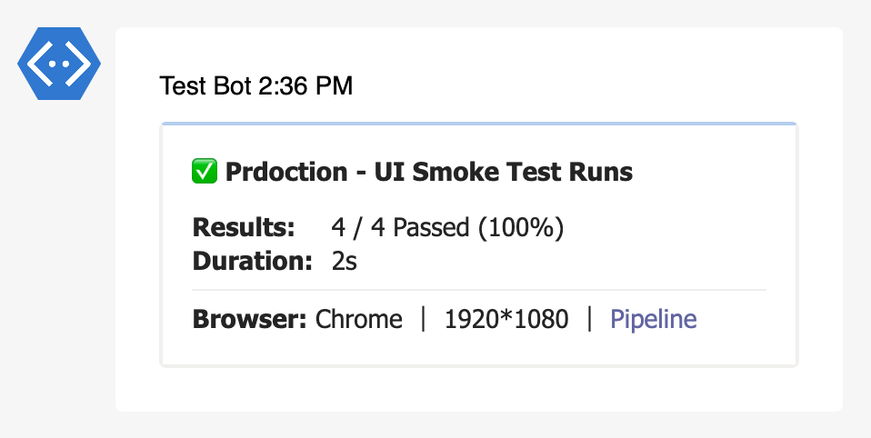

---
tags:
  - tags
  - links
---

# Metadata

Metadata extension will attach custom data to your reports.

::: details DEFAULTS

- hook: `end`
- condition: `passOrFail`

:::

## Syntax

```json
{
  "name": "metadata",
  "inputs": {
    "data": [
      {
        "key": "Browser",
        "value": "chrome"
      },
      {
        "value": "1920*1080"
      },
      {
        "key": "Build Logs",
        "value": "<build-logs-url>",
        "type": "hyperlink"
      },
      {
        "key": "Screenshots",
        "value": "<build-logs-url>",
        "type": "hyperlink",
        "condition": "fail"
      }
    ]
  }
}
```

- `data` (**object[]**) - list of metadata objects.
  - `key` (**string**) - text to display as a key.
  - `value` (**string**) - text to display as a value.
  - `type` (**string**) - type of metadata. allowed values - `hyperlink`
  - `condition?` (**[condition](/guides/conditions)**) - condition to include this metadata.

## Reports

### Teams




## Examples

Sample partial config file.

```js
{
  "reports": [
    {
      "targets": [
        {
          "name": "teams",
          "inputs": {
            "url": "<teams-incoming-webhook-url>"
          },
          "extensions": [
            {
              "name": "metadata",
              "inputs": {
                "data": [
                  {
                    "key": "Browser",
                    "value": "chrome"
                  },
                  {
                    "value": "1920*1080"
                  },
                  {
                    "key": "Build Logs",
                    "value": "<build-logs-url>",
                    "type": "hyperlink"
                  },
                  {
                    "key": "Screenshots",
                    "value": "<build-logs-url>",
                    "type": "hyperlink",
                    "condition": "fail"
                  }
                ]
              }
            }
          ]
        }
      ],
      "results": [
        {
          "type": "testng",
          "files": ["path/to/testng-results.xml"]
        }
      ]
    }
  ]
}
```