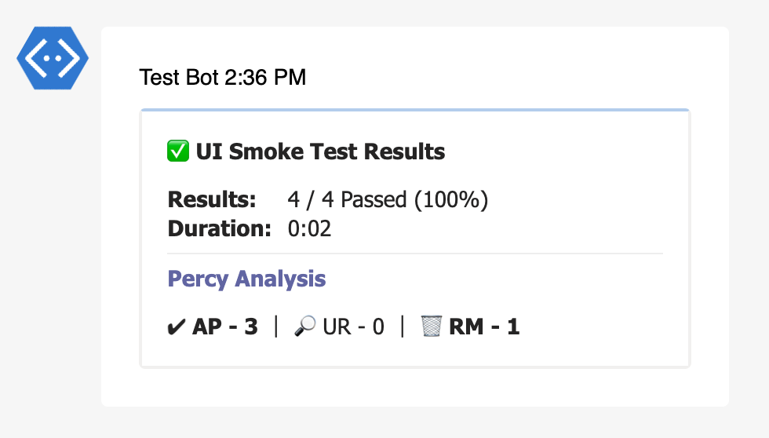

---
tags:
  - percy
---

# Percy Analysis

[Percy](https://percy.io/) is an all-in-one visual testing and review platform. This extension will include the number of snapshots approved and needs to be reviewed.

::: details DEFAULTS

- hook: `end`
- condition: `passOrFail`

:::

## Inputs

#### > token (string)

Percy integration token with **read** or **full** access.

#### > project_name (string)

Name of the project for reporting the last finished build results.

> Mandatory, if `project_id` and `build_id` are not available

#### > project_id (string)

Id of the project for reporting the last finished build results.

> Mandatory, if `project_name` and `build_id` are not available

#### > build_id (string)

Id of the build for reporting.

> Mandatory, if `project_name` and `project_id` are not available

#### > retries (number)

Number of retries to perform for a build to finish.

> Defaults to `10`. It waits `5` seconds between each try.

## Reports

### Teams



## Examples

#### Using project_name

```json {11-17}
{
  "reports": [
    {
      "targets": [
        {
          "name": "teams",
          "inputs": {
            "url": "<teams-incoming-webhook-url>"
          },
          "extensions": [
            {
              "name": "percy-analysis",
              "inputs": {
                "token": "<api-token>",
                "project_name": "<project-name>"
              }   
            }
          ]
        }
      ],
      "results": [
        {
          "type": "testng",
          "files": ["path/to/testng-results.xml"]
        }
      ]
    }
  ]
}
```