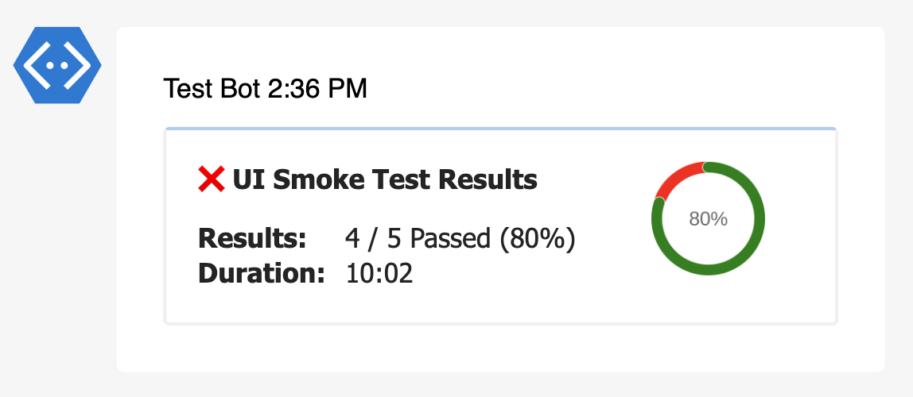

# QuickChart - Test Summary

[QuickChart](https://quickchart.io/) helps generate chart images with a simple, open API.

This extension will attach a radial gauge representing total pass percentage.

::: details DEFAULTS

- hook: `post-main`
- condition: `passOrFail`

:::

::: danger LIMITATIONS

This extension is not supported for **google chat** target.

:::

## Inputs

#### > url (string)

Quick Chart custom url _(https://your-domain.quickchart.com)_.

> Defaults to https://quickchart.io

## Reports

### Teams



### Slack


## Examples

#### Default

```json {11-19}
{
  "reports": [
    {
      "targets": [
        {
          "name": "teams",
          "inputs": {
            "url": "<teams-incoming-webhook-url>"
          },
          "extensions": [
            {
              "name": "quick-chart-test-summary"   
            }
          ]
        }
      ],
      "results": [
        {
          "type": "testng",
          "files": ["path/to/testng-results.xml"]
        }
      ]
    }
  ]
}
```

#### Custom URL

```json {11-19}
{
  "reports": [
    {
      "targets": [
        {
          "name": "teams",
          "inputs": {
            "url": "<teams-incoming-webhook-url>"
          },
          "extensions": [
            {
              "name": "quick-chart-test-summary",
              "inputs": {
                "url": "<quick-chart-base-url>"
              }   
            }
          ]
        }
      ],
      "results": [
        {
          "type": "testng",
          "files": ["path/to/testng-results.xml"]
        }
      ]
    }
  ]
}
```
