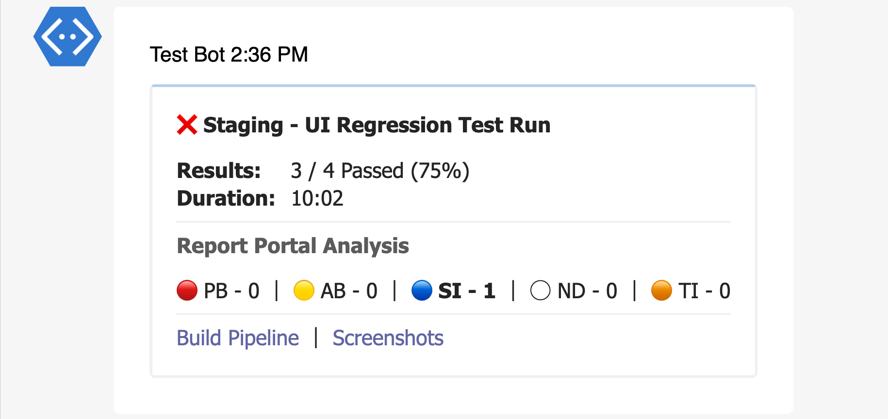

# Introduction

Test Results Reporter in an npm package used to publish test results from test frameworks like **Mocha**, **CucumberJS**, **JUnit**, **TestNG** and **xUnit** to Microsoft **Teams**, **Slack** and many more.

## Use Cases

This library is generally used as an alerting tool to forward the test results from our CI/CD environment to different entities like teams or slack.

### Supports

- UI Automation Test Results (Selenium, Cypress)
- API Automation Test Results (RestAssured, [PactumJS](https://pactumjs.github.io/))
- Performance Automation Test Results (k6)

## Sample Reports

#### Slack

#### Teams

## Need Help

We use Github [Discussions](https://github.com/test-results-reporter/reporter/discussions) to receive feedback, discuss ideas & answer questions. Head over to it and feel free to start a discussion. We are always happy to help 😊.

## Support Us

Like this project! Star it on [Github](https://github.com/test-results-reporter/reporter) ⭐. Your support means a lot to us.
