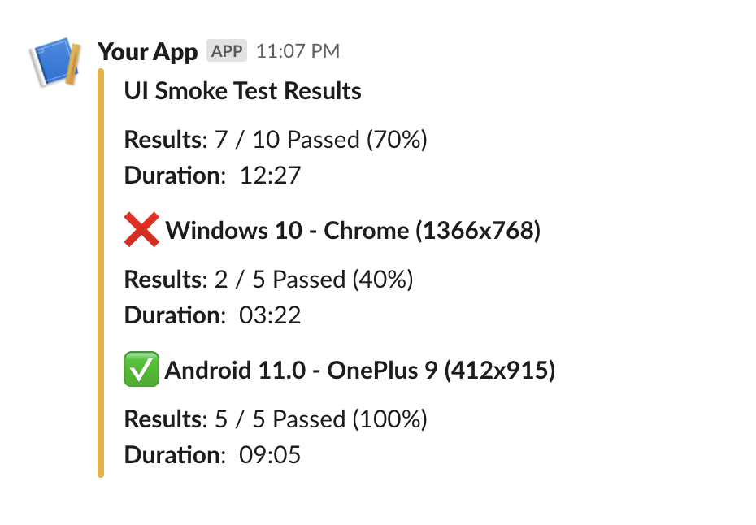
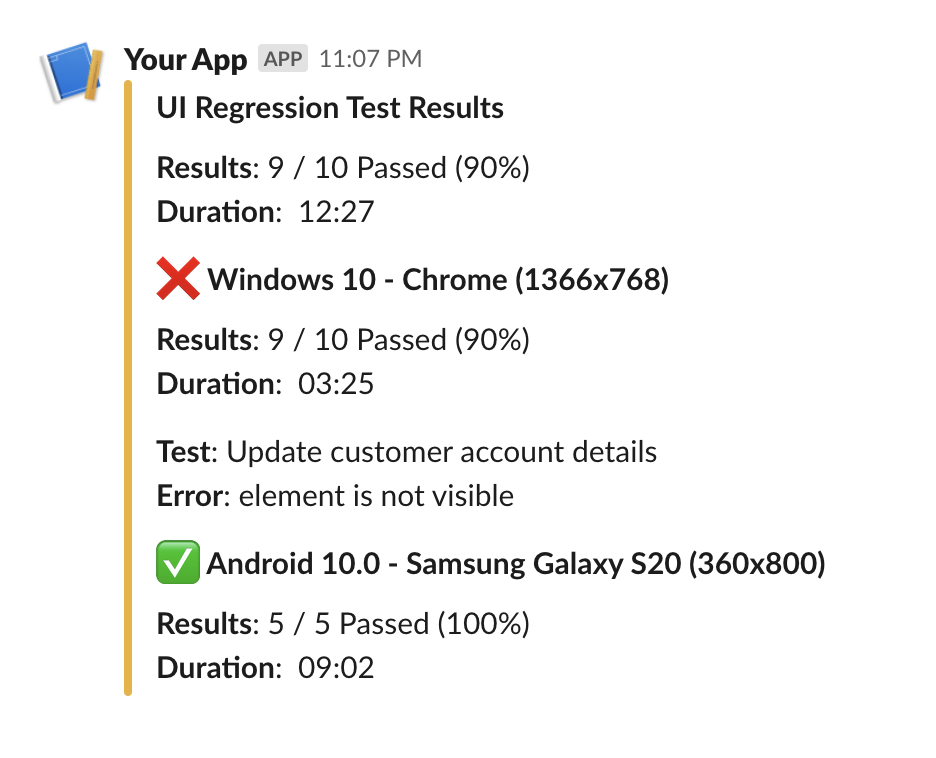

# Slack

Slack is a popular communication platform for teams. To send reports to a slack channel, we need to create a incoming webhook url. Follow this [docs](https://api.slack.com/messaging/webhooks) to create one.

## Syntax

```json
{
  "name": "slack",
  "condition": "fail",
  "inputs": {
    "url": "<slack-incoming-webhook-url>"
  }
}
```

- `url` (**string**) - incoming webhook url from slack.
- `publish?` (**string**) - type of report to be published to the slack channel. *defaults to `test-summary`*
  > `test-summary`, `test-summary-slim`, `failure-details`
- `only_failures?` (**boolean**) - only include failed test suite or test case details.
- `title?` (**string**) - title of the target to be displayed.
- `title_link?` (**string**) - attaches a clickable link to the title.
- `title_suffix?` (**string**) - adds a custom suffix to the title.

## Reports

### test-summary

It includes a test title, total duration and success percentage. If multiple suites are available, it also displays the above details per suite.

> Single Test Suite


> Multiple Test Suites



### test-summary-slim

It just includes a test title, total duration and success percentage. This report will totally ignore the test suites.

::: tip
This report type helps to maintain primary channels clean.
:::


### failure-details

This report will include the failed test case names along with the failure reasons.



## Examples

Sample config file.

```json {5-11}
{
  "reports": [
    {
      "targets": [
        {
          "name": "slack",
          "inputs": {
            "url": "<slack-incoming-webhook-url>",
            "publish": "test-summary-slim"
          }
        }
      ],
      "results": [
        {
          "type": "testng",
          "files": ["path/to/testng-results.xml"]
        }
      ]
    }
  ]
}
```