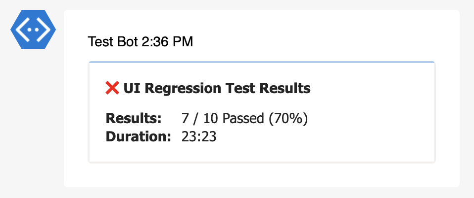
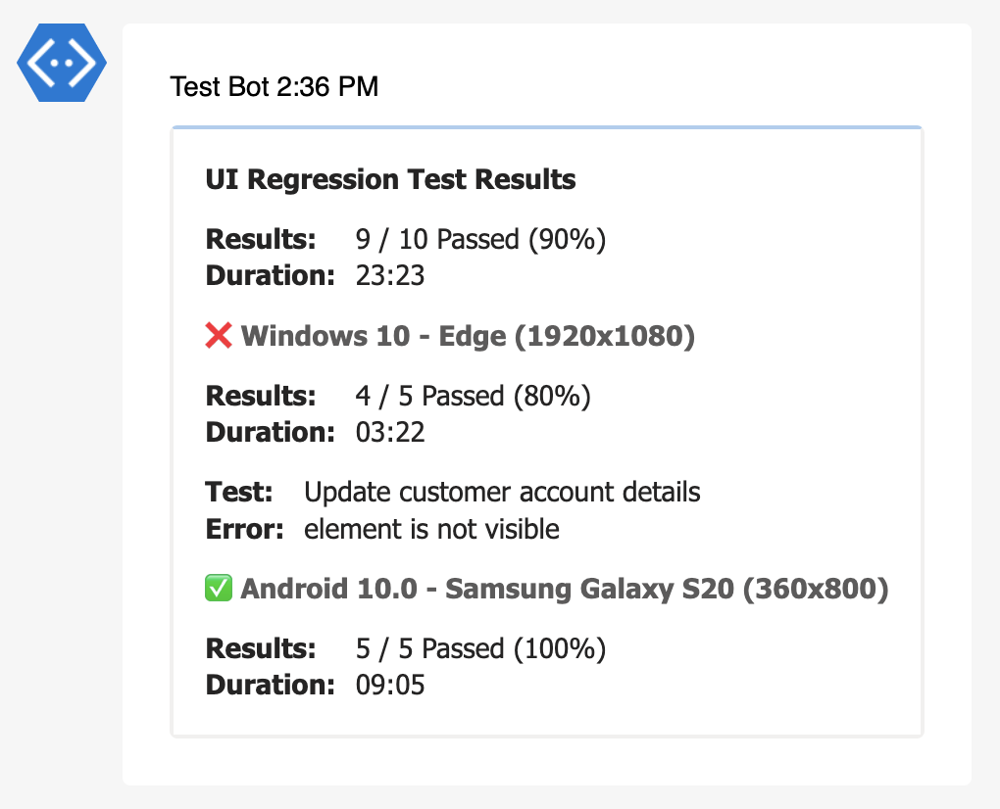

---
tags:
  - microsoft teams
  - teams
---

# Teams

Microsoft Teams is a communication platform. To send reports to a teams channel, we need to create a incoming webhook url. Follow this [docs](https://docs.microsoft.com/en-us/microsoftteams/platform/webhooks-and-connectors/how-to/add-incoming-webhook) to create one.

## Syntax

```json
{
  "name": "teams",
  "condition": "fail",
  "inputs": {
    "url": "<teams-incoming-webhook-url>"
  }
}
```

- `url` (**string**) - incoming webhook url from teams.
- `publish?` (**string**) - type of report to be published to the teams channel. *defaults to `test-summary`*
  > `test-summary`, `test-summary-slim`, `failure-details`
- `only_failures?` (**boolean**) - only include failed test suite or test case details.
- `title?` (**string**) - title of the target to be displayed.
- `title_link?` (**string**) - attaches a clickable link to the title.
- `title_suffix?` (**string**) - adds a custom suffix to the title.
- `max_suites` (**number**) - limit on the number of suites.*defaults to `10`*
- `width` (**string**) - controls the width of the message.
  > `Full`

## Reports

### test-summary

It includes a test title, total duration and success percentage. If multiple suites are available, it also displays the above details per suite.

> Single Test Suite


> Multiple Test Suites


### test-summary-slim

It just includes a test title, total duration and success percentage. This report will totally ignore the test suites.

::: tip
This report type  helps to maintain primary channels clean.
:::



### failure-details

This report will include the failed test case names along with the failure reasons.



## Examples

Sample config file.

```json {3-9}
{
  "targets": [
    {
      "name": "teams",
      "inputs": {
        "url": "<teams-incoming-webhook-url>",
        "publish": "test-summary-slim"
      }
    }
  ],
  "results": [
    {
      "type": "testng",
      "files": [
        "path/to/testng-results.xml"
      ]
    }
  ]
}
```
