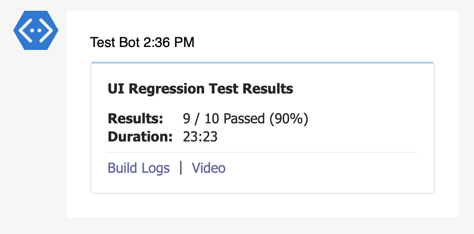

# Links

Links extension will add handy links to the teams or slack reports.

## Arguments

#### > links (object[])

Array of link objects

#### > link.text (string)

Text to display on the message.

#### > link.url (string)

Url to link to the given text in the message.

## Reports

### Teams



## Examples

Sample partial config file.

```json {10-24}
{
  "targets": [
    {
      "name": "teams",
      "inputs": {
        "url": "<incoming-webhook-url>",
        "publish": "test-summary"
      },
      "extensions": [
        {
          "name": "links",
          "inputs": {
            "links": [
              {
                "text": "Build Logs",
                "url": "<build-logs-url>"
              },
              {
                "text": "Video",
                "url": "<video-url>"
              }
            ]
          }   
        }
      ]
    }
  ]
}
```